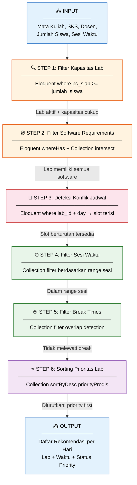
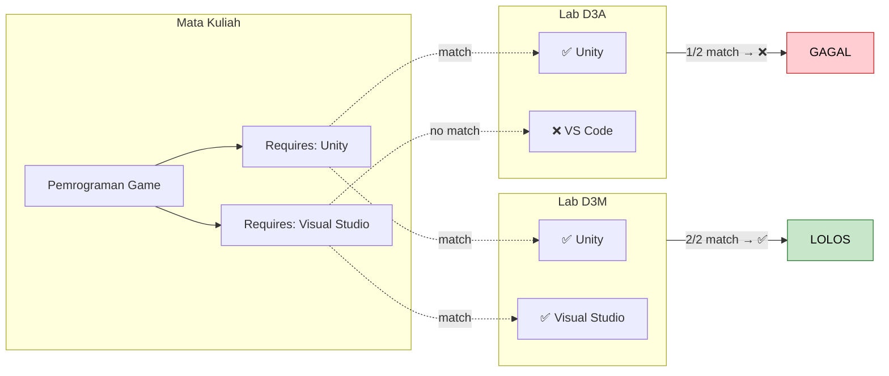
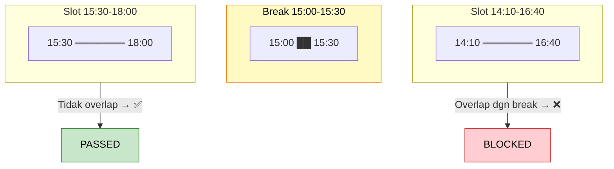
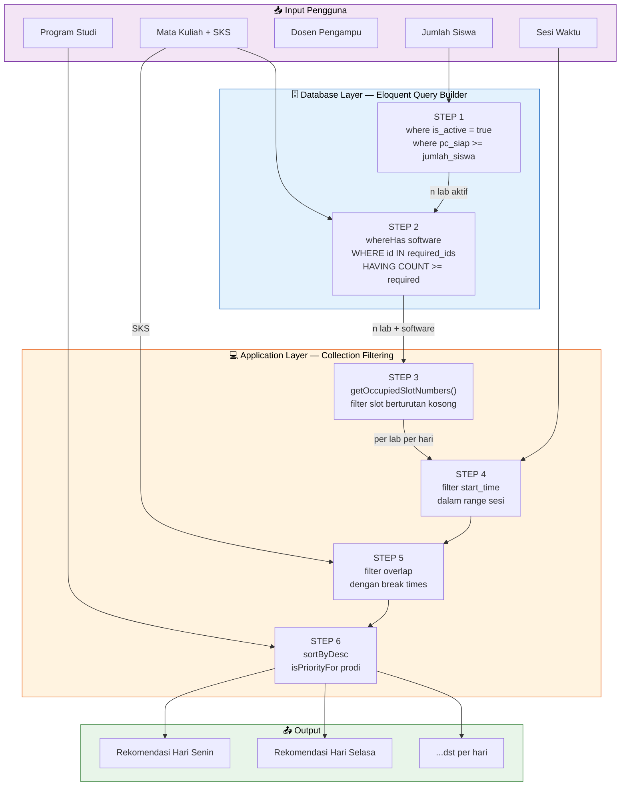
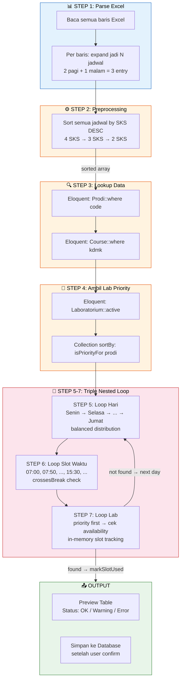
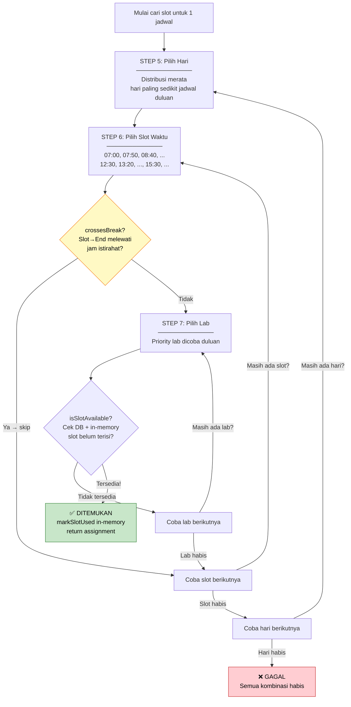

# Diagram Alur Eloquent Query Filtering untuk Penjadwalan Otomatis Laboratorium

> **Skripsi:** _Penerapan Teknik Query Filtering Eloquent untuk Penyelesaian Masalah Constraint Satisfaction dalam Penjadwalan Otomatis Laboratorium Komputer_

---

## Ringkasan Proses

Sistem penjadwalan otomatis SIOPAL menerapkan **6 tahap filtering berurutan** menggunakan Eloquent Query Builder dan Collection Filtering pada Laravel. Setiap tahap merepresentasikan satu **constraint** dalam formulasi CSP (Constraint Satisfaction Problem).



---

## Klasifikasi Teknik Filtering

| Tahap  | Constraint            | Teknik                                                | Layer           |
| ------ | --------------------- | ----------------------------------------------------- | --------------- |
| Step 1 | Kapasitas Lab         | **Eloquent `where()`**                                | Database (SQL)  |
| Step 2 | Software Requirements | **Eloquent `whereHas()`** + **Collection `filter()`** | Database + PHP  |
| Step 3 | Konflik Jadwal        | **Eloquent `where()`** + **PHP loop**                 | Database + PHP  |
| Step 4 | Sesi Waktu            | **Collection `filter()`**                             | PHP (in-memory) |
| Step 5 | Break Times           | **Collection `filter()`**                             | PHP (in-memory) |
| Step 6 | Prioritas Lab         | **Collection `sortByDesc()`**                         | PHP (in-memory) |

> **Pola:** Constraint yang bersifat **statis** (kapasitas, software) difilter di **database layer** menggunakan Eloquent Query Builder. Constraint yang bersifat **dinamis** (sesi, break, konflik) difilter di **application layer** menggunakan Laravel Collection.

---

## Detail Setiap Tahap

### Step 1: Filter Kapasitas Laboratorium

**Tujuan:** Mengeliminasi lab yang tidak memiliki cukup PC untuk menampung jumlah mahasiswa.

**File:** `app/Services/SchedulingService.php` — method `getAvailableLabs()`

```php
// Eloquent Query Builder: WHERE clause
$query = Laboratorium::where('is_active', true);

if ($studentCount > 0) {
    $query->where('pc_siap', '>=', $studentCount);
}
```

**SQL yang dihasilkan:**

```sql
SELECT * FROM laboratoria
WHERE is_active = 1
  AND pc_siap >= ?    -- parameter: jumlah_siswa
```

**Contoh:**

```
Input:  Jumlah Siswa = 30
Lab D3A (pc_siap=35) → ✅ LOLOS (35 >= 30)
Lab D3B (pc_siap=25) → ❌ GAGAL (25 < 30)
Lab D3M (pc_siap=40) → ✅ LOLOS (40 >= 30)
```

---

### Step 2: Filter Software Requirements

**Tujuan:** Memastikan lab memiliki **semua** software yang dibutuhkan oleh mata kuliah.

**File:** `app/Services/SchedulingService.php` — method `getAvailableLabs()`

```php
// Ambil software yang dibutuhkan mata kuliah
$requiredSoftwareIds = $course->requiredSoftware()
    ->pluck('software_details.id')->toArray();

if (!empty($requiredSoftwareIds)) {
    $requiredCount = count($requiredSoftwareIds);

    // Eloquent whereHas: subquery COUNT
    $query->whereHas('software', function ($q) use ($requiredSoftwareIds) {
        $q->whereIn('software_details.id', $requiredSoftwareIds);
    }, '>=', $requiredCount);
}
```

**SQL yang dihasilkan:**

```sql
SELECT l.* FROM laboratoria l
WHERE is_active = 1
  AND pc_siap >= ?
  AND (
    SELECT COUNT(DISTINCT s.id)
    FROM software_details s
    JOIN inventories i ON i.inventoriable_id = s.id
      AND i.inventoriable_type = 'App\\Models\\SoftwareDetail'
    WHERE i.laboratorium_id = l.id
      AND s.id IN (?, ?, ?)    -- required software IDs
  ) >= ?                        -- required count
```

**Contoh:**

```
Mata Kuliah: Pemrograman Game
Required Software: [Unity, Visual Studio]

Lab D3A → Software terpasang: [Unity, VS Code]     → ❌ GAGAL (VS Code ≠ VS)
Lab D3M → Software terpasang: [Unity, Visual Studio] → ✅ LOLOS
```



---

### Step 3: Deteksi Konflik Jadwal (Slot Availability)

**Tujuan:** Menemukan slot waktu berturutan yang belum ditempati jadwal lain di lab+hari tersebut.

**File:** `app/Services/SchedulingService.php` — method `getAvailableSlots()` + `getOccupiedSlotNumbers()`

**Sub-step 3a: Query jadwal yang sudah ada**

```php
// Eloquent: ambil semua jadwal di lab+hari ini
$schedules = Schedule::where('laboratorium_id', $labId)
    ->where('day', $day)
    ->when($excludeScheduleId, fn($q) => $q->where('id', '!=', $excludeScheduleId))
    ->with('timeSlot')
    ->get();

// Hitung slot_number yang sudah terisi
foreach ($schedules as $schedule) {
    $startNumber = $schedule->timeSlot->slot_number;
    $duration = $schedule->duration_slots;
    for ($i = 0; $i < $duration; $i++) {
        $occupiedNumbers[] = $startNumber + $i;  // contoh: [7, 8, 9]
    }
}
```

**Sub-step 3b: Cari slot berturutan yang kosong**

```php
// Collection filter: cek N slot berturutan
$allSlots->filter(function ($slot) use ($occupiedSlotNumbers, $slotsNeeded) {
    for ($i = 0; $i < $slotsNeeded; $i++) {
        $checkSlotNumber = $slot->slot_number + $i;

        if (in_array($checkSlotNumber, $occupiedSlotNumbers)) {
            return false;  // Bentrok!
        }
    }
    return true;  // Semua slot kosong
});
```

**Visualisasi (3 SKS = 3 slot berturutan):**

```
Slot Number:  7     8     9     10    11    12    13
Waktu:       12:30 13:20 14:10 15:00 15:30 16:20 17:10
Status:       ██    ██    ░░    ░░    ░░    ░░    ░░
              ↑occupied          ↑available

Cek mulai slot 7:  [7♦ 8♦ 9] → Slot 7 occupied → ❌
Cek mulai slot 8:  [8♦ 9  10] → Slot 8 occupied → ❌
Cek mulai slot 9:  [9  10 11] → Semua kosong    → ✅ LOLOS
Cek mulai slot 10: [10 11 12] → Semua kosong    → ✅ LOLOS
Cek mulai slot 11: [11 12 13] → Semua kosong    → ✅ LOLOS
```

---

### Step 4: Filter Sesi Waktu

**Tujuan:** Membatasi slot hanya pada rentang waktu sesi yang dipilih pengguna.

**File:** `app/Filament/Pages/ScheduleWizard.php` — method `findAvailableSlots()`

```php
// Definisi rentang sesi
$sessionTimes = [
    'pagi'  => ['start' => '07:00', 'end' => '12:20'],
    'siang' => ['start' => '12:30', 'end' => '18:20'],
    'malam' => ['start' => '18:30', 'end' => '22:00'],
];

// Collection filter: cek apakah start_time ada dalam range sesi
$filteredSlots = $availableSlots->filter(function ($slot) use ($sessionRange) {
    $slotStartTime = Carbon::parse($slot->start_time)->format('H:i');
    return $slotStartTime >= $sessionRange['start']
        && $slotStartTime < $sessionRange['end'];
});
```

**Contoh (Sesi: Siang):**

```
Available slots dari Step 3:
  09:30 → ❌ (< 12:30, bukan sesi siang)
  10:20 → ❌ (< 12:30, bukan sesi siang)
  14:10 → ✅ (>= 12:30 dan < 18:20)
  15:00 → ✅ (>= 12:30 dan < 18:20)
  15:30 → ✅ (>= 12:30 dan < 18:20)
  18:30 → ❌ (>= 18:20, sesi malam)
```

---

### Step 5: Filter Break Times (Dynamic)

**Tujuan:** Mengeliminasi slot yang blok waktunya (start→end) melewati jam istirahat.

**File:** `app/Services/SchedulingService.php` — method `getSlotOptionsForForm()` + `getBreakTimes()`

```php
// Break times dinamis berdasarkan SKS + sesi
$breakTimes = SchedulingService::getBreakTimes($course->sks, $sesi);

// Collection filter: overlap detection
$slots->filter(function ($slot) use ($slotsNeeded, $breakTimes) {
    $slotStart = Carbon::parse($slot->start_time)->format('H:i');
    $endTime = $this->calculateEndTime($slot, $slotsNeeded);

    foreach ($breakTimes as $break) {
        // Overlap jika: mulai < break_end DAN selesai > break_start
        if ($slotStart < $break['end'] && $endTime > $break['start']) {
            return false;
        }
    }
    return true;
});
```

**Rumus Overlap Detection:**

```
Overlap terjadi jika dan hanya jika:
    slot_start < break_end  DAN  slot_end > break_start

Equivalen dengan:
    NOT (slot_end <= break_start OR slot_start >= break_end)
```

**Contoh (3 SKS Siang, Break Sore = 15:00-15:30):**

```
Slot 14:10 → end: 16:40
  Check break 15:00-15:30: 14:10 < 15:30 ✓ AND 16:40 > 15:00 ✓ → OVERLAP ❌

Slot 15:00 → end: 17:30
  Check break 15:00-15:30: 15:00 < 15:30 ✓ AND 17:30 > 15:00 ✓ → OVERLAP ❌

Slot 15:30 → end: 18:00
  Check break 15:00-15:30: 15:30 < 15:30 ✗ → NO OVERLAP ✅
  Check break 18:00-18:30: 15:30 < 18:30 ✓ AND 18:00 > 18:00 ✗ → NO OVERLAP ✅
  → LOLOS ✅
```



---

### Step 6: Sorting Prioritas Lab

**Tujuan:** Mengurutkan hasil rekomendasi sehingga lab prioritas untuk prodi muncul di atas.

**File:** `app/Filament/Pages/ScheduleWizard.php` — method `findAvailableSlots()`

```php
// Cek apakah lab merupakan prioritas untuk prodi mata kuliah
$isPriority = $course->prodi_id
    ? $lab->priorityProdis->contains('id', $course->prodi_id)
    : false;

// Collection sort: prioritas di atas
usort($dayRecommendations, function ($a, $b) {
    if ($a['is_priority'] !== $b['is_priority']) {
        return $b['is_priority'] <=> $a['is_priority']; // Priority first
    }
    return $a['start_time'] <=> $b['start_time'];       // Then by time
});
```

**Contoh:**

```
Sebelum sorting:
  1. Lab D3M  (15:30-18:00) — Non-priority
  2. Lab D3A  (12:30-15:00) — ⭐ Priority
  3. Lab D3M  (12:30-15:00) — Non-priority

Setelah sorting:
  1. Lab D3A  (12:30-15:00) — ⭐ Priority    ← naik ke atas
  2. Lab D3M  (12:30-15:00) — Non-priority
  3. Lab D3M  (15:30-18:00) — Non-priority
```

---

## Diagram Keseluruhan: Data Flow dari Input ke Output



---

## Contoh Eksekusi Lengkap

**Input:**

- Mata Kuliah: Pemrograman Game (3 SKS)
- Jumlah Siswa: 30
- Sesi: Siang (12:30)

| Step   | Proses                             | Jumlah Kandidat         |
| ------ | ---------------------------------- | ----------------------- |
| Start  | Semua lab                          | 10 lab                  |
| Step 1 | `WHERE pc_siap >= 30`              | 6 lab                   |
| Step 2 | `WHERE HAS Unity, Visual Studio`   | 3 lab                   |
| Step 3 | Cek slot kosong (per lab × 5 hari) | 15 kombinasi lab-hari   |
| Step 4 | Filter sesi siang (12:30-18:20)    | 9 slot                  |
| Step 5 | Filter break overlap (15:00-15:30) | 5 slot                  |
| Step 6 | Sort priority                      | 5 rekomendasi (terurut) |

> Setiap tahap mengurangi jumlah kandidat, menyerupai prinsip **constraint propagation** dalam CSP.

---

## Hubungan dengan Constraint Satisfaction Problem (CSP)

| Komponen CSP   | Implementasi SIOPAL                       |
| -------------- | ----------------------------------------- |
| **Variabel**   | Jadwal (kombinasi lab + hari + slot)      |
| **Domain**     | Semua kemungkinan lab × hari × slot       |
| **Constraint** | 6 tahap filtering di atas                 |
| **Solusi**     | Assignment yang memenuhi SEMUA constraint |

**Teknik CSP yang digunakan:**

1. **Forward Checking** — Setiap constraint langsung mengeliminasi kandidat yang tidak valid (Eloquent `where` dan Collection `filter`)
2. **Constraint Propagation** — Step 1-6 berurutan, output satu step menjadi input step berikutnya
3. **Heuristic Ordering** — SKS tinggi diproses duluan (pada bulk import), lab priority didahulukan

---

---

# Metode 2: Bulk Import Excel (Penjadwalan Otomatis Massal)

> **File utama:** `app/Imports/BulkScheduleImport.php`

Selain input satuan (Metode 1 di atas), sistem juga mendukung **import massal via Excel**. Pengguna mengunggah file Excel berisi permintaan matakuliah beserta jumlah kelas yang dibutuhkan, dan sistem **otomatis memplot seluruh jadwal** ke lab dan slot yang tersedia.

## Input Excel

| Kolom     | Deskripsi               | Contoh           |
| --------- | ----------------------- | ---------------- |
| `prodi`   | Kode program studi      | A11              |
| `kdmk`    | Kode mata kuliah        | A11.64710        |
| `nama_mk` | Nama mata kuliah        | Pemrograman Game |
| `sks`     | Jumlah SKS              | 3                |
| `pagi`    | Jumlah kelas pagi/siang | 2                |
| `malam`   | Jumlah kelas malam      | 1                |

Dari satu baris ini, sistem menghasilkan **3 jadwal** (2 pagi + 1 malam) yang masing-masing harus ditempatkan di lab dan slot yang tersedia.

---

## Diagram Alur Bulk Import



---

## Detail Setiap Tahap

### Step 1: Parse Excel → Expand ke Individual Schedules

**Tujuan:** Satu baris Excel mungkin membutuhkan beberapa kelas. Baris di-expand menjadi individual schedule entries.

```php
// Per baris Excel: expand menjadi N jadwal
private function collectScheduleData($row): void
{
    $pagiCount = (int) ($row['pagi'] ?? 0);
    $malamCount = (int) ($row['malam'] ?? 0);

    // Expand: 1 baris → pagiCount + malamCount jadwal
    for ($i = 1; $i <= $pagiCount; $i++) {
        $this->pendingSchedules[] = [
            'sesi' => 'pagi',
            'kelompok' => "{$kdmk}-" . str_pad($i, 2, '0', STR_PAD_LEFT),
            // ...
        ];
    }
    for ($i = 1; $i <= $malamCount; $i++) {
        $this->pendingSchedules[] = [
            'sesi' => 'malam',
            'kelompok' => "{$kdmk}-M" . str_pad($i, 2, '0', STR_PAD_LEFT),
            // ...
        ];
    }
}
```

**Contoh:**

```
Baris Excel: Pemrograman Game | 3 SKS | pagi=2, malam=1

Expand menjadi 3 entry:
  1. {sesi: pagi,  kelompok: A11.64710-01, sks: 3}
  2. {sesi: pagi,  kelompok: A11.64710-02, sks: 3}
  3. {sesi: malam, kelompok: A11.64710-M01, sks: 3}
```

---

### Step 2: Sort by SKS DESC (Heuristic Ordering)

**Tujuan:** Mata kuliah dengan SKS tinggi lebih sulit ditempatkan karena butuh slot berturutan yang panjang. Diproses duluan agar mendapat prioritas.

```php
// SKS tinggi duluan → constraint propagation heuristic
usort($this->pendingSchedules, function ($a, $b) {
    return $b['sks'] <=> $a['sks'];  // DESC
});
```

**Contoh:**

```
Sebelum sort:               Setelah sort:
  Basis Data (2 SKS)          Pemrograman Game (3 SKS)  ← duluan
  Pemrograman Game (3 SKS)    Pemrograman Game (3 SKS)
  Algoritma (2 SKS)           Basis Data (2 SKS)
  Pemrograman Game (3 SKS)    Algoritma (2 SKS)
```

> **Alasan:** 3 SKS butuh 3 slot berturutan (150 menit) yang lebih susah ditemukan daripada 2 slot (100 menit). Kalau 2 SKS diproses duluan dan mengambil slot, mungkin tidak tersisa cukup slot berturutan untuk 3 SKS.

---

### Step 3: Lookup Prodi & Course

**Tujuan:** Mapping kode Excel ke entitas database menggunakan Eloquent query.

```php
// Lookup prodi by code (handle whitespace)
$prodi = Prodi::whereRaw('TRIM(code) = ?', [$prodiCode])->first();

// Lookup course by KDMK, fallback by nama
$course = Course::where('code', $kdmk)->first();
if (!$course && !empty($namaMk)) {
    $course = Course::whereRaw('LOWER(name) = ?', [strtolower($namaMk)])->first();
}
```

**SQL yang dihasilkan:**

```sql
-- Prodi lookup
SELECT * FROM prodis WHERE TRIM(code) = 'A11' LIMIT 1;

-- Course lookup (primary)
SELECT * FROM courses WHERE code = 'A11.64710' LIMIT 1;

-- Course lookup (fallback)
SELECT * FROM courses WHERE LOWER(name) = 'pemrograman game' LIMIT 1;
```

---

### Step 4: Ambil Lab + Sort by Priority

**Tujuan:** Mendapatkan semua lab aktif dan mengurutkan berdasarkan prioritas prodi.

```php
private function getLabsByPriority(?Prodi $prodi): Collection
{
    $labs = Laboratorium::active()->get();

    return $labs->sortBy(function ($lab) use ($prodi) {
        if ($lab->isPriorityFor($prodi->id)) {
            return 0; // Priority labs first
        }
        return 1;
    });
}
```

**Contoh (Prodi: Teknik Informatika):**

```
Sebelum sort:                       Setelah sort:
  Lab D3A (non-priority)              Lab D3M (⭐ priority TI)  ← dicoba duluan
  Lab D3B (non-priority)              Lab D3A
  Lab D3M (⭐ priority for TI)        Lab D3B
```

---

### Step 5-7: Triple Nested Loop (Hari × Slot × Lab)

Ini adalah inti dari algoritma penjadwalan bulk. Sistem mencari slot pertama yang tersedia dengan iterasi tiga lapis:



#### Step 5: Loop Hari (Day Distribution)

```php
// Distribusi merata: hari yang paling sedikit jadwal dicoba duluan
$dayOrder = $this->getDayOrder();  // ['Senin','Selasa','Rabu','Kamis','Jumat']

foreach ($dayOrder as $day) {
    // ...try slots on this day
}
```

#### Step 6: Loop Slot Waktu + Break Check

```php
foreach ($startTimes as $startTime) {
    $endTime = $this->calculateEndTime($startTime, $sks * 50);

    // Dynamic break check based on SKS + sesi
    if ($this->crossesBreak($startTime, $endTime, $sks, $sesi)) {
        continue;  // Skip — melewati break
    }
    // ...try labs for this slot
}
```

**Sesai pagi/siang mengiterasi:**

```
07:00 → 07:50 → 08:40 → 09:30 → 10:20 → 11:10
12:30 → 13:20 → 14:10 → 15:00 → 15:30
16:20 → 17:10
```

#### Step 7: Loop Lab + In-Memory Tracking

```php
foreach ($labs as $lab) {
    if ($this->isSlotAvailable($lab->id, $day, $startTime, $endTime, $sks)) {
        // Mark slot as used IN MEMORY (tidak hit DB lagi)
        $this->markSlotUsed($lab->id, $day, $startTime, $sks);
        return $assignment;  // ← DITEMUKAN!
    }
}
```

**In-memory slot tracking** — kunci performa bulk import:

```php
// Track: "labId_day" => [slot_numbers yang sudah diisi]
private array $usedSlotNumbers = [];

private function isSlotAvailable(...): bool
{
    $key = "{$labId}_{$day}";

    // Inisialisasi dari DB HANYA sekali per lab+day
    if (!isset($this->usedSlotNumbers[$key])) {
        $this->usedSlotNumbers[$key] = $this->getOccupiedSlotNumbersFromDB($labId, $day);
    }

    // Cek in-memory (sangat cepat, O(n))
    for ($i = 0; $i < $slotsNeeded; $i++) {
        if (in_array($startSlotNumber + $i, $this->usedSlotNumbers[$key])) {
            return false;
        }
    }
    return true;
}
```

> **Mengapa in-memory?** Jika ada 50 jadwal di Excel dan 10 lab × 5 hari, tanpa in-memory tracking akan ada ~2500 query ke database. Dengan in-memory, hanya ~50 query (sekali per kombinasi lab+day yang unik), sisanya cek di PHP array — **50x lebih cepat**.

---

## Contoh Eksekusi Bulk Import

**Input Excel (3 baris):**

| Prodi | KDMK      | Nama MK          | SKS | Pagi | Malam |
| ----- | --------- | ---------------- | --- | ---- | ----- |
| A11   | A11.64710 | Pemrograman Game | 3   | 2    | 0     |
| A11   | A11.64301 | Basis Data       | 2   | 3    | 1     |
| A12   | A12.64201 | Algoritma        | 2   | 2    | 0     |

**Proses:**

```
STEP 1: Parse → 8 individual schedules
  Game-01 (3 SKS pagi), Game-02 (3 SKS pagi)
  Basdat-01 (2 SKS pagi), Basdat-02 (2 SKS pagi), Basdat-03 (2 SKS pagi)
  Basdat-M01 (2 SKS malam)
  Algo-01 (2 SKS pagi), Algo-02 (2 SKS pagi)

STEP 2: Sort SKS DESC
  1. Game-01   (3 SKS)  ← diproses duluan
  2. Game-02   (3 SKS)
  3. Basdat-01 (2 SKS)
  4. Basdat-02 (2 SKS)
  5. Basdat-03 (2 SKS)
  6. Basdat-M01(2 SKS malam)
  7. Algo-01   (2 SKS)
  8. Algo-02   (2 SKS)

STEP 3-7: Per jadwal, cari slot:

  ┌─ Game-01 (3 SKS pagi) ──────────────────────────────────┐
  │ Lookup: Prodi A11, Course A11.64710                      │
  │ Labs priority: [D3M⭐, D3A, D3B]                         │
  │ Try Senin/12:30 → D3M: slot [7,8,9] available → ✅      │
  │ Result: D3M, Senin, 12:30-15:00                          │
  │ markSlotUsed: D3M_Senin → [7,8,9]                       │
  └──────────────────────────────────────────────────────────┘

  ┌─ Game-02 (3 SKS pagi) ──────────────────────────────────┐
  │ Labs priority: [D3M⭐, D3A, D3B]                         │
  │ Try Senin/12:30 → D3M: slot 7 occupied (in-memory) → ❌ │
  │ Try Senin/15:30 → D3M: slot [11,12,13] available → ✅   │
  │ Result: D3M, Senin, 15:30-18:00                          │
  │ markSlotUsed: D3M_Senin → [7,8,9,11,12,13]              │
  └──────────────────────────────────────────────────────────┘

  ┌─ Basdat-01 (2 SKS pagi) ────────────────────────────────┐
  │ Try Senin/07:00 → D3M: slot [1,2] available → ✅        │
  │ Result: D3M, Senin, 07:00-08:40                          │
  └──────────────────────────────────────────────────────────┘
  ...dst
```

---

## Perbandingan: Input Satuan vs Bulk Import

| Aspek               | Input Satuan (ScheduleWizard)         | Bulk Import (Excel)                      |
| ------------------- | ------------------------------------- | ---------------------------------------- |
| **Input**           | 1 matkul, user pilih dari rekomendasi | N matkul dari Excel, auto-assign         |
| **Lab filtering**   | Kapasitas + software                  | Hanya lab aktif (semua lab)              |
| **Slot search**     | Per lab, semua hari sekaligus         | Triple loop: hari → slot → lab           |
| **Conflict check**  | DB query langsung                     | DB + **in-memory tracking**              |
| **Break filtering** | Collection `filter()`                 | `crossesBreak()` per-slot                |
| **Heuristic**       | Priority sort di output               | SKS DESC sort **+ priority lab first**   |
| **Output**          | Tabel rekomendasi (user pilih)        | Preview table (auto-assign)              |
| **Teknik CSP**      | Forward Checking                      | Forward Checking + Backtracking implisit |
