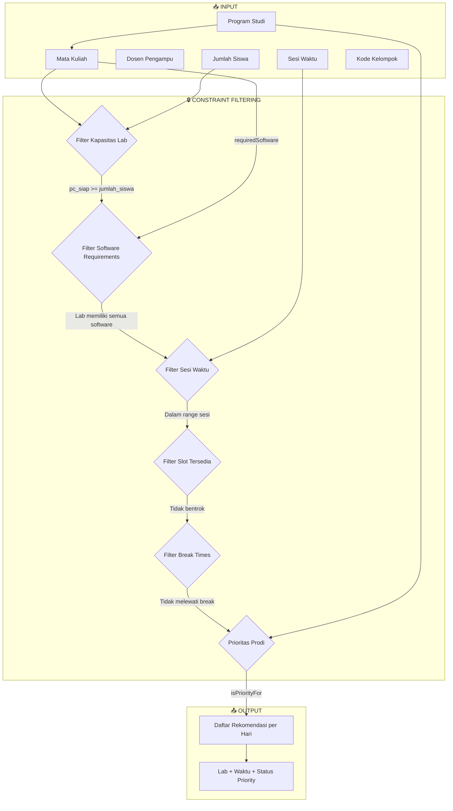
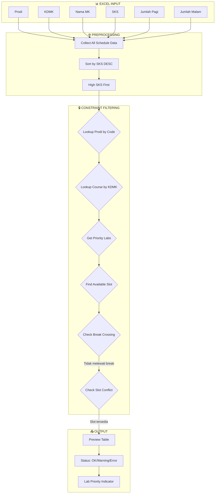
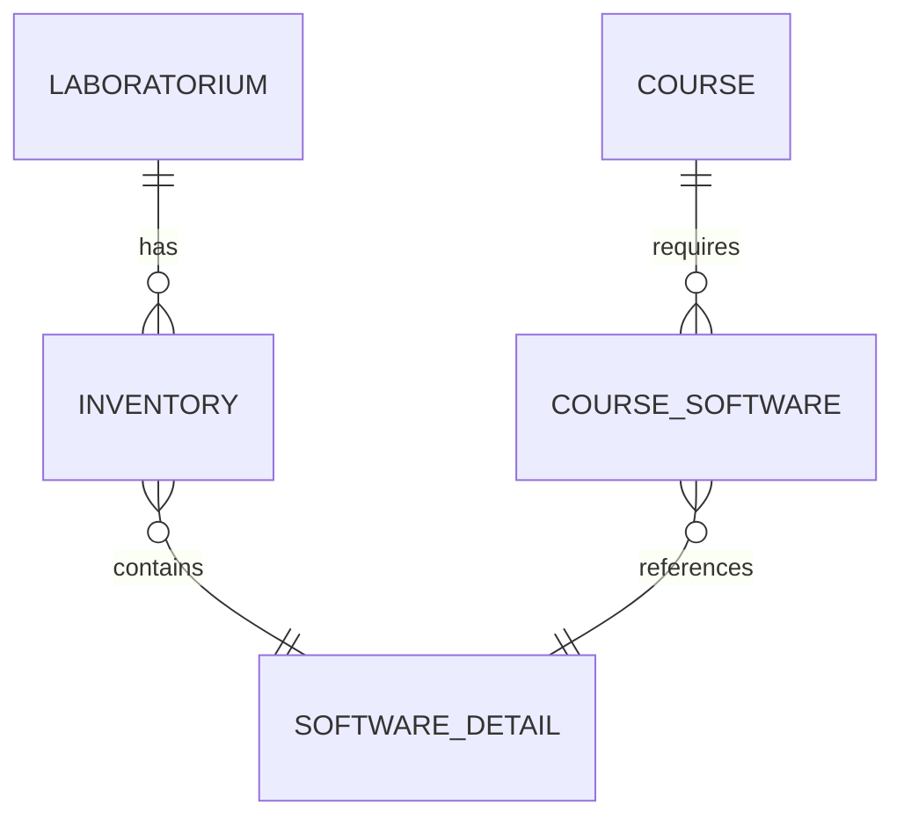
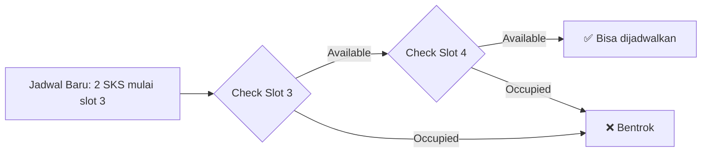
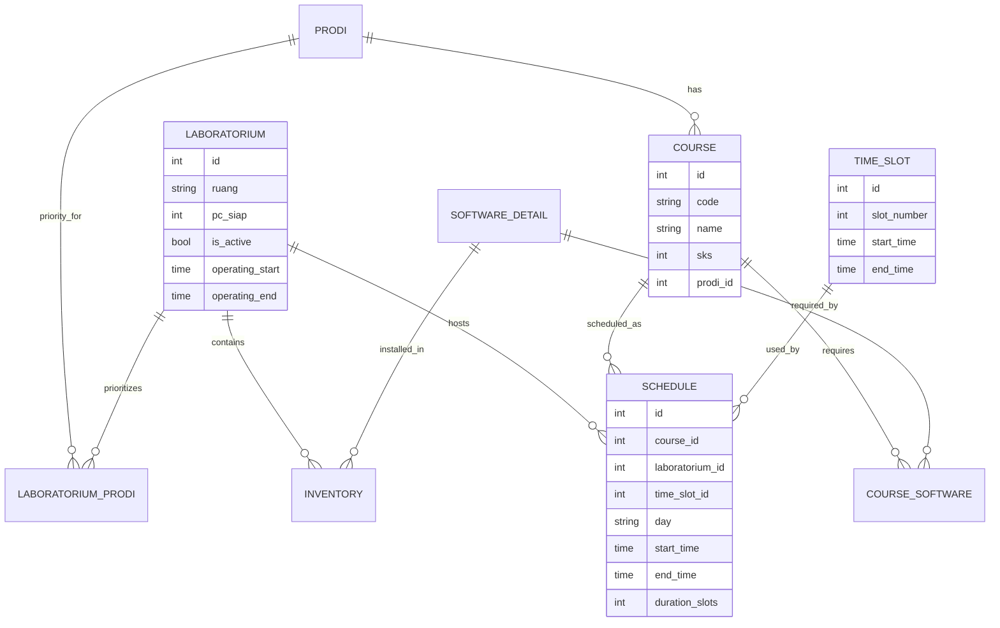

# Dokumentasi Teknis Penjadwalan Otomatis Laboratorium SIOPAL

## Ringkasan Sistem

Sistem penjadwalan otomatis SIOPAL menggunakan pendekatan **Constraint Satisfaction Problem (CSP)** dengan implementasi **Eloquent Query Filtering** pada Laravel. Sistem menyediakan dua metode input:

1. **Input Satuan** - Melalui halaman Penjadwalan Otomatis
2. **Import Excel** - Bulk import dengan sorting berdasarkan SKS

---

## 1. Diagram Alur Sistem

### 1.1 Input Satuan (ScheduleWizard)



### 1.2 Import Excel (BulkScheduleImport)



---

## 2. Constraint Filtering Detail

### 2.1 Daftar Constraint

| #   | Constraint                | Deskripsi                                   | Prioritas  |
| --- | ------------------------- | ------------------------------------------- | ---------- |
| 1   | **Kapasitas Lab**         | `pc_siap >= jumlah_siswa`                   | Wajib      |
| 2   | **Software Requirements** | Lab memiliki SEMUA software yang dibutuhkan | Wajib      |
| 3   | **Ketersediaan Slot**     | Tidak bentrok dengan jadwal existing        | Wajib      |
| 4   | **Jam Operasional**       | Dalam rentang 07:00 - 21:00                 | Wajib      |
| 5   | **Break Times**           | Tidak melewati jam istirahat                | Wajib      |
| 6   | **Sesi Waktu**            | Sesuai dengan sesi (pagi/siang/malam)       | Wajib      |
| 7   | **Prioritas Prodi**       | Lab prioritas didahulukan                   | Preferensi |
| 8   | **SKS Tinggi Duluan**     | Matkul dengan SKS besar diproses first      | Preferensi |

### 2.2 Time Slot Configuration

```
Durasi per slot: 50 menit (1 SKS = 1 slot)

Default Break Times (2 SKS):
├── 12:00 - 12:30 (Istirahat Siang)
├── 15:50 - 16:20 (Istirahat Sore)
└── 18:00 - 18:30 (Istirahat Malam)

Dynamic Break Times (3+ SKS Siang):
├── 12:00 - 12:30 (Istirahat Siang)
├── 15:00 - 15:30 (Istirahat Sore ← digeser dari 15:50)
└── 18:00 - 18:30 (Istirahat Malam)

Session Ranges:
├── Pagi:  07:00 - 12:00 (5 slots)
├── Siang: 12:30 - 15:50 (4 slots, + slot 15:30 untuk 3 SKS)
├── Sore:  16:20 - 18:00 (2 slots)
└── Malam: 18:30 - 21:00 (3 slots)
```

> **Catatan:** Untuk penjelasan lengkap kasus 3 SKS siang, lihat
> [docs/DYNAMIC_BREAK_3SKS.md](DYNAMIC_BREAK_3SKS.md)

---

## 3. Implementasi Eloquent Query Filtering

### 3.1 Filter Kapasitas Laboratorium

**File:** `app/Services/SchedulingService.php` (line 39-45)

```php
// Query dasar: lab aktif dengan kapasitas mencukupi
$query = Laboratorium::where('is_active', true);

// Filter kapasitas jika jumlah mahasiswa > 0
if ($studentCount > 0) {
    $query->where('pc_siap', '>=', $studentCount);
}
```

**SQL Equivalent:**

```sql
SELECT * FROM laboratoria
WHERE is_active = 1
  AND pc_siap >= :student_count
```

---

### 3.2 Filter Software Requirements

**File:** `app/Services/SchedulingService.php` (line 48-55)

```php
// Filter software requirements jika ada
if (!empty($requiredSoftwareIds)) {
    $requiredCount = count($requiredSoftwareIds);

    // Lab harus memiliki SEMUA software yang dibutuhkan
    $query->whereHas('software', function ($q) use ($requiredSoftwareIds) {
        $q->whereIn('software_details.id', $requiredSoftwareIds);
    }, '>=', $requiredCount);
}
```

**SQL Equivalent:**

```sql
SELECT l.* FROM laboratoria l
WHERE (
    SELECT COUNT(DISTINCT i.inventoriable_id)
    FROM inventories i
    WHERE i.laboratorium_id = l.id
      AND i.inventoriable_type = 'App\\Models\\SoftwareDetail'
      AND i.inventoriable_id IN (:required_software_ids)
) >= :required_count
```

**Diagram Relasi:**



---

### 3.3 Filter Ketersediaan Slot (Conflict Detection)

**File:** `app/Services/SchedulingService.php` (line 135-171)

```php
public function getOccupiedSlotNumbers(int $labId, string $day, ?int $excludeScheduleId = null): array
{
    $schedules = Schedule::where('laboratorium_id', $labId)
        ->where('day', $day)
        ->when($excludeScheduleId, fn($q) => $q->where('id', '!=', $excludeScheduleId))
        ->with('timeSlot')
        ->get();

    $occupiedNumbers = [];

    foreach ($schedules as $schedule) {
        if ($schedule->time_slot_id && $schedule->timeSlot) {
            $startNumber = $schedule->timeSlot->slot_number;
            $duration = $schedule->duration_slots ?? 1;

            // Mark ALL slots covered by this schedule
            for ($i = 0; $i < $duration; $i++) {
                $occupiedNumbers[] = $startNumber + $i;
            }
        }
    }

    return array_unique($occupiedNumbers);
}
```

**Algoritma Slot Checking:**



---

### 3.4 Filter Sesi Waktu

**File:** `app/Filament/Pages/ScheduleWizard.php` (line 252-297)

```php
// Define session time ranges
$sessionTimes = [
    'pagi'  => ['start' => '07:00', 'end' => '12:20'],
    'siang' => ['start' => '12:30', 'end' => '18:20'],
    'malam' => ['start' => '18:30', 'end' => '22:00'],
];

// Filter slots by session time range
$filteredSlots = $availableSlots->filter(function ($slot) use ($sessionRange) {
    $slotStartTime = Carbon::parse($slot->start_time)->format('H:i');
    return $slotStartTime >= $sessionRange['start']
        && $slotStartTime < $sessionRange['end'];
});
```

---

### 3.5 Filter Break Times (Dynamic)

**File:** `app/Services/SchedulingService.php`

Break times sekarang **dinamis** berdasarkan SKS dan sesi. Untuk 3+ SKS siang, break sore digeser dari 15:50-16:20 ke **15:00-15:30**.

```php
// Centralized dynamic break times
public static function getBreakTimes(int $sks = 2, ?string $sesi = null): array
{
    if ($sks >= 3 && $sesi === 'siang') {
        return self::BREAKS_3SKS_SIANG; // break sore: 15:00-15:30
    }
    return self::DEFAULT_BREAKS;         // break sore: 15:50-16:20
}
```

**Filter overlap di `getSlotOptionsForForm()`:**

```php
$breakTimes = self::getBreakTimes($slotsNeeded, 'siang');

$slots = $slots->filter(function ($slot) use ($slotsNeeded, $breakTimes) {
    $slotStart = Carbon::parse($slot->start_time)->format('H:i');
    $endTime = $this->calculateEndTime($slot, $slotsNeeded);

    foreach ($breakTimes as $break) {
        if ($slotStart < $break['end'] && $endTime > $break['start']) {
            return false;
        }
    }
    return true;
});
```

**Visualisasi Overlap Detection:**

```
Break Time:     [====12:00-12:30====]

Slot 10:30-12:30:   [==============]
                           ↑ OVERLAP! ❌

Slot 12:30-14:10:              [==============]
                                     ↑ OK ✅
```

---

### 3.6 Prioritas Lab untuk Prodi

**File:** `app/Models/Laboratorium.php` (line 140-143)

```php
public function isPriorityFor(int $prodiId): bool
{
    return $this->priorityProdis()->where('prodis.id', $prodiId)->exists();
}
```

**SQL Equivalent:**

```sql
SELECT EXISTS(
    SELECT 1 FROM laboratorium_prodi lp
    JOIN prodis p ON lp.prodi_id = p.id
    WHERE lp.laboratorium_id = :lab_id
      AND p.id = :prodi_id
) as is_priority
```

---

## 4. Import Excel: SKS-Based Sorting

**File:** `app/Imports/BulkScheduleImport.php` (line 57-76)

```php
public function collection(Collection $rows): void
{
    // First pass: collect all schedule data
    foreach ($rows as $row) {
        $this->collectScheduleData($row);
    }

    // Sort by SKS DESC - higher SKS gets priority for lab assignment
    usort($this->pendingSchedules, function ($a, $b) {
        return $b['sks'] <=> $a['sks'];
    });

    // Second pass: process sorted schedules
    foreach ($this->pendingSchedules as $scheduleData) {
        $this->generateSchedule($scheduleData);
    }
}
```

**Alasan SKS Sorting:**

- Matkul dengan SKS tinggi (4 SKS = 200 menit) membutuhkan slot berturutan yang panjang
- Lebih sulit menemukan slot 4 berturutan dibanding 2 berturutan
- Dengan diproses duluan, matkul SKS tinggi mendapat kesempatan lab priority

---

## 5. Diagram Entity Relationship



---

## 6. Teknik Query Optimization

### 6.1 Eager Loading untuk N+1 Prevention

```php
// ❌ BAD: N+1 Problem
$labs = Laboratorium::all();
foreach ($labs as $lab) {
    $lab->priorityProdis; // Query per iteration
}

// ✅ GOOD: Eager Loading
$labs = Laboratorium::with(['priorityProdis', 'kategori'])->get();
```

### 6.2 Conditional Query dengan `when()`

```php
$schedules = Schedule::where('laboratorium_id', $labId)
    ->where('day', $day)
    ->when($excludeScheduleId, fn($q) => $q->where('id', '!=', $excludeScheduleId))
    ->get();
```

### 6.3 In-Memory Slot Tracking untuk Bulk Import

```php
// Track used slot_numbers per lab+day
private array $usedSlotNumbers = [];

private function isSlotAvailable(int $labId, string $day, string $startTime, ...): bool
{
    $key = "{$labId}_{$day}";

    // Initialize from DB on first check
    if (!isset($this->usedSlotNumbers[$key])) {
        $this->usedSlotNumbers[$key] = $this->getOccupiedSlotNumbersFromDB($labId, $day);
    }

    // Check in-memory for subsequent checks (faster)
    for ($i = 0; $i < $slotsNeeded; $i++) {
        if (in_array($startSlotNumber + $i, $this->usedSlotNumbers[$key])) {
            return false;
        }
    }
    return true;
}
```

---

## 7. Error Handling dan Failure Reasons

```php
// Detailed failure reason tracking
if ($labs->isEmpty()) {
    $this->lastFailureReason = 'Tidak ada lab aktif';
} elseif ($totalCheckedSlots == 0 && $crossesBreakCount > 0) {
    $this->lastFailureReason = "SKS {$sks} ({$durationMinutes} menit) melewati break";
} elseif ($labFullCount > 0) {
    $this->lastFailureReason = "Semua {$labs->count()} lab penuh";
}
```

---

## 8. Kesimpulan

Sistem penjadwalan otomatis SIOPAL mengimplementasikan:

1. **Constraint Satisfaction** - Memenuhi semua constraint wajib sebelum scheduling
2. **Eloquent Query Builder** - Menggunakan where, whereHas, when untuk filter dinamis
3. **Collection Filtering** - PHP Collection untuk post-query filtering (break times, session)
4. **In-Memory Caching** - usedSlotNumbers untuk optimasi bulk import
5. **Priority-Based Assignment** - SKS tinggi dan lab prioritas didahulukan

---

_Dokumentasi ini dibuat untuk keperluan skripsi: "Teknik Query Filtering Eloquent untuk Penjadwalan Otomatis Laboratorium"_
