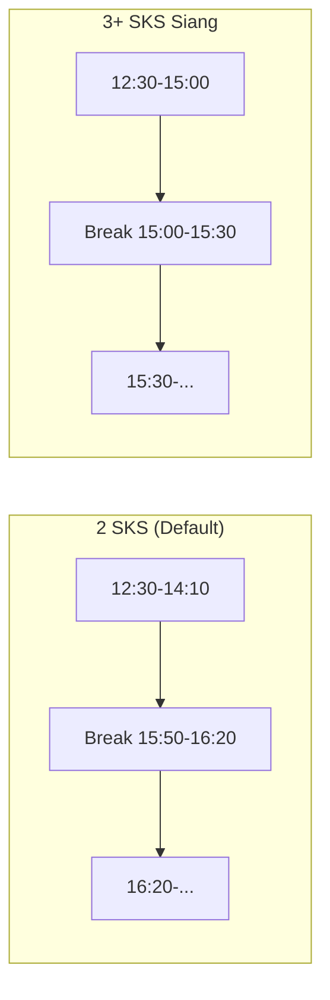

# Dynamic Break Time untuk Mata Kuliah 3+ SKS Siang

## Latar Belakang

Sistem penjadwalan SIOPAL menggunakan **break time fixed** setiap 30 menit di antara sesi:

| Break | Waktu         | Keterangan         |
| ----- | ------------- | ------------------ |
| Siang | 12:00 - 12:30 | Setelah sesi pagi  |
| Sore  | 15:50 - 16:20 | Setelah sesi siang |
| Malam | 18:00 - 18:30 | Setelah sesi sore  |

Break time ini dirancang untuk blok **2 SKS** (100 menit). Satu blok siang 2 SKS:

```
12:30 → 13:20 (slot 1)
13:20 → 14:10 (slot 2)
─── end time: 14:10, cukup sebelum break 15:50 ───
```

## Masalah: 3 SKS Siang

Untuk mata kuliah **3 SKS siang** (150 menit = 3 × 50 menit), jadwal yang dimulai pukul 12:30:

```
12:30 → 13:20 (slot 1)
13:20 → 14:10 (slot 2)
14:10 → 15:00 (slot 3)
─── end time: 15:00 ───
```

Mata kuliah berakhir pukul **15:00**, tapi break sore baru di **15:50**. Ini menimbulkan masalah:

- Gap 50 menit antara akhir kuliah (15:00) dan break sore (15:50) tidak efisien
- Slot berikutnya baru mulai 16:20 (setelah break), terlalu lama menunggu
- Idealnya, break langsung setelah kuliah selesai: **15:00 - 15:30**

## Solusi: Dynamic Break Times

### Konsep

Break sore **digeser** dari 15:50-16:20 ke **15:00-15:30** khusus ketika ada matkul 3+ SKS siang.



### Perbandingan Timeline

```
=== 2 SKS (Default Breaks) ===
12:30  13:20  14:10  15:00  15:50 [BREAK] 16:20  17:10  18:00 [BREAK] 18:30
 ├──────┼──────┤                   ├──30──┤ ├──────┼──────┤      ├──30──┤
 │  2 SKS blok │                   │break │ │  2 slot     │      │break │
 └──────┴──────┘                   └──────┘ └──────┴──────┘      └──────┘

=== 3 SKS Siang (Shifted Breaks) ===
12:30  13:20  14:10  15:00 [BREAK] 15:30  16:20  17:10  18:00 [BREAK] 18:30
 ├──────┼──────┼──────┤     ├──30──┤ ├──────┼──────┼──────┤      ├──30──┤
 │  3 SKS blok       │     │break │ │  3 SKS blok       │      │break │
 └──────┴──────┴──────┘     └──────┘ └──────┴──────┴──────┘      └──────┘
```

### Slot yang Valid untuk 3 SKS Siang

| Start Time | End Time  | Break Setelahnya | Status                   |
| ---------- | --------- | ---------------- | ------------------------ |
| 12:30      | 15:00     | 15:00-15:30      | ✅ Valid                 |
| **15:30**  | **18:00** | **18:00-18:30**  | ✅ **Valid (slot baru)** |
| 18:30      | 21:00     | -                | ✅ Valid (malam)         |

> **Penting:** TimeSlot `15:30-16:20` (slot_number 11) ditambahkan ke database khusus untuk kasus ini.

## Implementasi Teknis

### 1. Centralized Break Times (`SchedulingService`)

```php
// app/Services/SchedulingService.php

public const DEFAULT_BREAKS = [
    ['start' => '12:00', 'end' => '12:30'],
    ['start' => '15:50', 'end' => '16:20'], // ← default sore
    ['start' => '18:00', 'end' => '18:30'],
];

public const BREAKS_3SKS_SIANG = [
    ['start' => '12:00', 'end' => '12:30'],
    ['start' => '15:00', 'end' => '15:30'], // ← digeser
    ['start' => '18:00', 'end' => '18:30'],
];

public static function getBreakTimes(int $sks = 2, ?string $sesi = null): array
{
    if ($sks >= 3 && $sesi === 'siang') {
        return self::BREAKS_3SKS_SIANG;
    }
    return self::DEFAULT_BREAKS;
}
```

### 2. TimeSlot Database

```
slot_number  start_time  end_time
─────────────────────────────────
...
9            14:10       15:00
10           15:00       15:50
11           15:30       16:20    ← BARU (untuk 3 SKS siang)
12           16:20       17:10
13           17:10       18:00
...
```

### 3. File yang Terpengaruh

| File                                          | Perubahan                                           |
| --------------------------------------------- | --------------------------------------------------- |
| `app/Services/SchedulingService.php`          | `getBreakTimes()`, `generateTimeSlots()`, constants |
| `app/Filament/Resources/ScheduleResource.php` | Helper text pakai filtered count                    |
| `app/Filament/Pages/ScheduleWizard.php`       | Dynamic breaks di rekomendasi                       |
| `app/Imports/BulkScheduleImport.php`          | Dynamic `crossesBreak()` + start time 15:30         |
| `app/Filament/Pages/ScheduleTimetable.php`    | Grid timetable dinamis per-lab                      |
| `app/Exports/LabScheduleSheet.php`            | Export Excel grid dinamis per-lab                   |

### 4. Timetable & Export (Display Dinamis)

Timetable visual dan export Excel mendeteksi apakah lab memiliki jadwal 3+ SKS siang. Jika ya, grid waktu otomatis menggunakan break sore 15:00-15:30:

```php
// ScheduleTimetable.php & LabScheduleSheet.php
$has3SksSiang = Schedule::where('laboratorium_id', $labId)
    ->whereHas('course', fn($q) => $q->where('sks', '>=', 3))
    ->where('sesi', 'siang')
    ->exists();

$breaks = SchedulingService::getBreakTimes(
    $has3SksSiang ? 3 : 2,
    $has3SksSiang ? 'siang' : null
);
```

## Dampak terhadap 2 SKS

> **Tidak ada dampak.** Matkul 2 SKS tetap menggunakan `DEFAULT_BREAKS` (15:50-16:20).
> Dynamic break **hanya aktif** ketika `sks >= 3` **DAN** `sesi === 'siang'`.

## Catatan Penting

1. **TimeSlot 15:30** harus ada di database. Jalankan seeder atau tambahkan manual jika belum ada.
2. **Slot_number** bergeser: slot ≥ 11 naik +1 setelah insert slot 15:30.
3. Jadwal existing **tidak terpengaruh** karena reference via `time_slot_id` (primary key), bukan `slot_number`.
4. Timetable grid **per-lab** — jika Lab A punya 3 SKS siang dan Lab B tidak, masing-masing menampilkan grid break yang berbeda.
